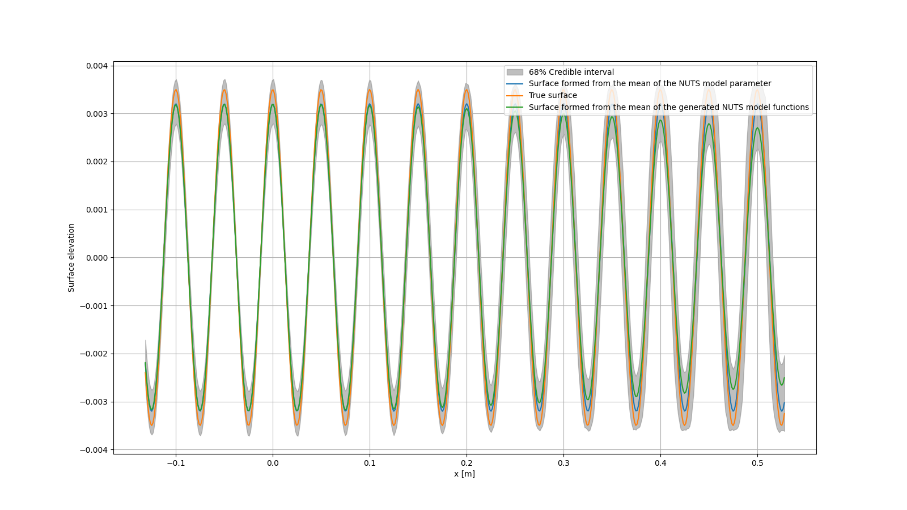
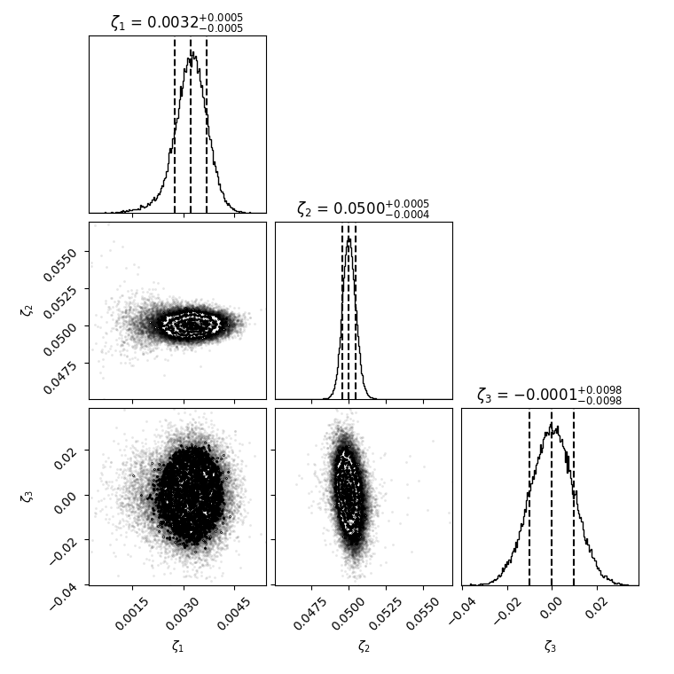

## About

The scripts in this repository can be used to reconstruct a sinusoidal surface from scattered acoustic data. Uses pymc with a Jax backend. Can be used with CPU or GPU solver, however currently only linux supports the GPU solver.

## Example Results

## Build
Clone the repository and run the main.py script with the requirements listed in the requirements.txt file. These can be installed by running `python pip install -r requirements.txt`. It is recommended to set up a virtual environment in the repository to install the packages to.